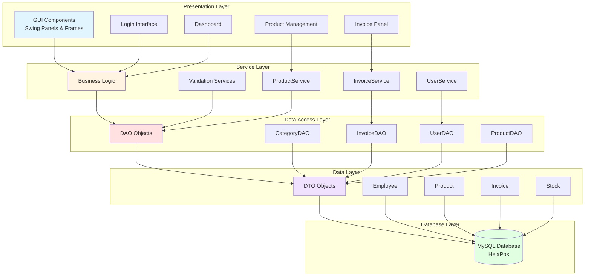
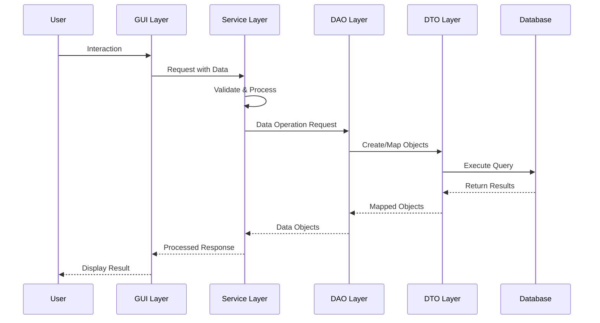
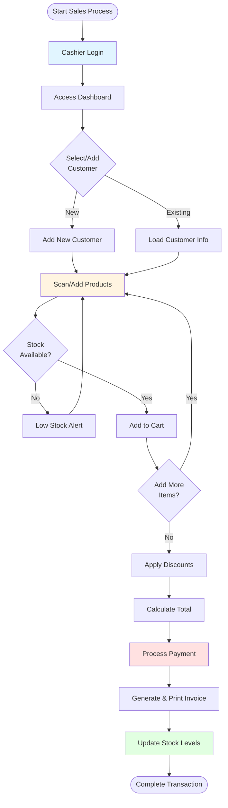
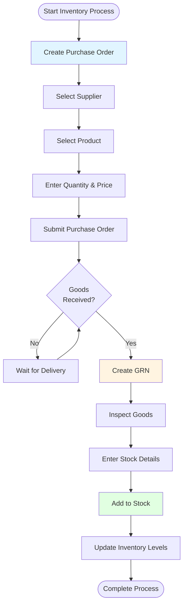
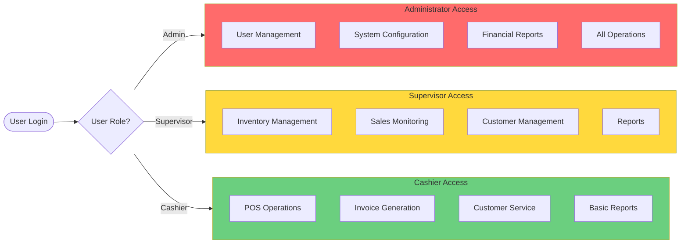
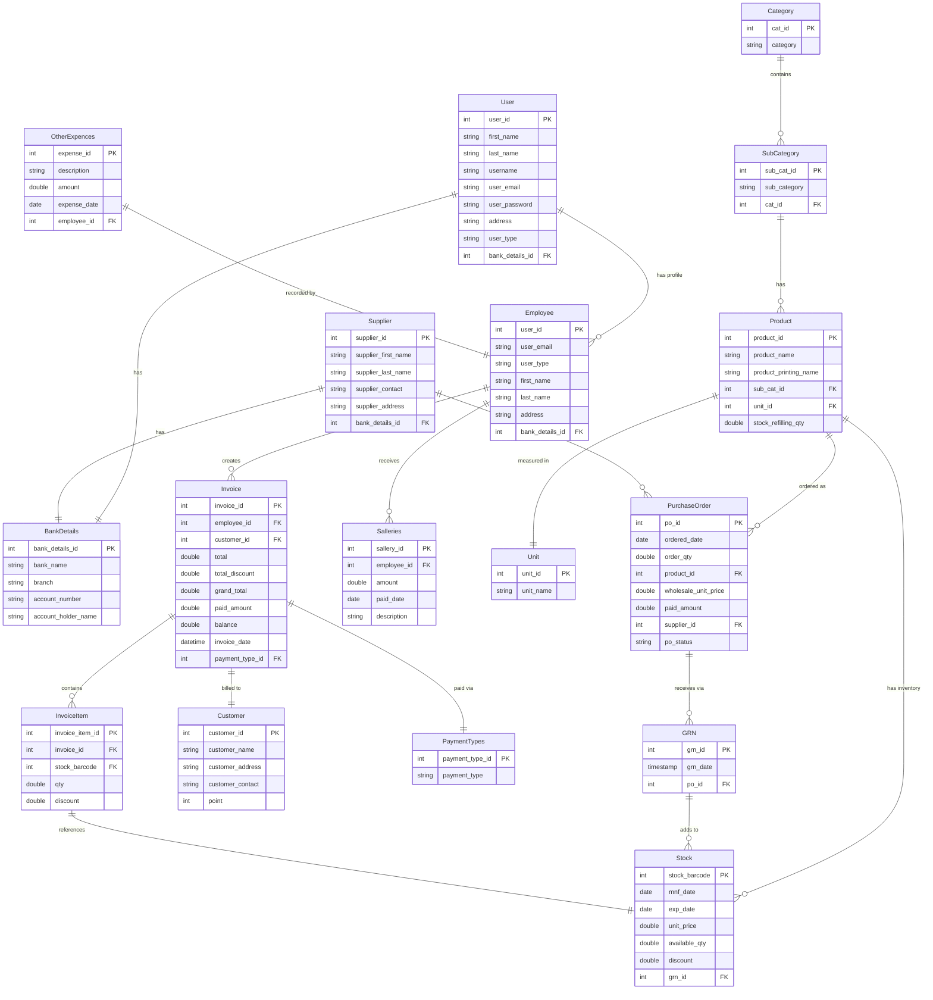

# 🏪 helaPOS - Point of Sale System

<div align="center">


[](https://www.oracle.com/java/)
[](https://netbeans.apache.org/)
[](https://www.mysql.com/)
[](LICENSE)

**A comprehensive Point of Sale (POS) system built with Java Swing for retail business management**

</div>

## 📋 Table of Contents

- [Overview](#-overview)
- [Features](#-features)
- [Technology Stack](#-technology-stack)
- [System Architecture](#-system-architecture)
- [Installation & Setup](#-installation--setup)
- [Database Setup](#-database-setup)
- [Usage Guide](#-usage-guide)
- [Project Structure](#-project-structure)
- [User Roles & Permissions](#-user-roles--permissions)
- [Documentation](#-documentation)
- [Contributing](#-contributing)
- [License](#-license)
- [Contact](#-contact)

## 🌟 Overview

**helaPOS** is a modern, feature-rich Point of Sale system designed for retail businesses. Built with Java Swing, it provides a comprehensive solution for managing sales, inventory, customers, suppliers, and employees. The system supports multiple user roles with appropriate permissions and includes advanced features like purchase order management, goods receipt notes (GRN), and detailed reporting.

### 🎯 Key Objectives

- **Efficient Sales Management**: Streamline the sales process with an intuitive interface
- **Inventory Control**: Real-time stock management and tracking
- **User Management**: Role-based access control for different user types
- **Business Intelligence**: Comprehensive reporting and analytics
- **Data Integrity**: Robust validation and error handling

## ✨ Features

### 🛒 Sales Management
- **Point of Sale Interface**: User-friendly sales processing
- **Invoice Generation**: Automated invoice creation and printing
- **Payment Processing**: Multiple payment method support
- **Discount Management**: Item-level and invoice-level discounts
- **Customer Management**: Customer information and purchase history

### 📦 Inventory Management
- **Product Catalog**: Comprehensive product information management
- **Category & Subcategory**: Hierarchical product organization
- **Unit Management**: Multiple unit types (pieces, kg, liters, etc.)
- **Stock Tracking**: Real-time inventory levels
- **Stock Alerts**: Low stock notifications and reorder points

### 🏢 Purchase Management
- **Supplier Management**: Supplier information and contact details
- **Purchase Orders**: Create and manage purchase orders
- **Goods Receipt Notes (GRN)**: Track incoming inventory
- **Purchase History**: Complete purchase audit trail

### 👥 User Management
- **Multi-Role Support**: Admin, Supervisor, and Cashier roles
- **User Authentication**: Secure login system
- **Employee Management**: Staff information and salary tracking
- **Permission Control**: Role-based feature access

### 📊 Reporting & Analytics
- **Sales Reports**: Daily, weekly, monthly sales analysis
- **Inventory Reports**: Stock levels and movement reports
- **Financial Reports**: Revenue and expense tracking
- **Dashboard**: Real-time business metrics

### 🔧 System Features
- **Database Integration**: MySQL database connectivity
- **Data Validation**: Comprehensive input validation
- **Error Handling**: Robust exception management
- **Backup Support**: Database backup and restore capabilities

## 🛠 Technology Stack

### Core Technologies
- **Programming Language**: Java 20
- **GUI Framework**: Java Swing
- **Database**: MySQL 8.0+
- **Build Tool**: Apache Ant
- **IDE**: NetBeans 21

### Libraries & Dependencies
- **Lombok**: Annotation-based code generation
- **MySQL Connector**: Database connectivity
- **Java AWT/Swing**: User interface components

### Development Tools
- **Version Control**: Git
- **Database Design**: MySQL Workbench
- **Project Management**: NetBeans IDE

## 🏗 System Architecture

### Layered Architecture Overview



### Architecture Flow



### Design Patterns Used
- **MVC (Model-View-Controller)**: Separation of concerns
- **DAO Pattern**: Data access abstraction
- **DTO Pattern**: Data transfer between layers
- **Singleton Pattern**: Database connection management
- **Observer Pattern**: GUI component updates

### System Workflows

#### Sales Process Flow



#### Inventory Management Flow



#### User Access Control



## 🚀 Installation & Setup

### Prerequisites

#### Java Development Kit (JDK) 20
Download and install JDK 20 from the following link:
- [JDK 20 Windows x64](https://download.java.net/openjdk/jdk20/ri/openjdk-20+36_windows-x64_bin.zip)

**Installation Steps:**
1. Download the JDK 20 package
2. Extract to your preferred directory (e.g., `C:\Program Files\Java\jdk-20`)
3. Set `JAVA_HOME` environment variable
4. Add `%JAVA_HOME%\bin` to your PATH

#### NetBeans 21 IDE
Download and install NetBeans 21 IDE from the following link:
- [NetBeans 21 Windows x64](https://dlcdn.apache.org/netbeans/netbeans-installers/21/Apache-NetBeans-21-bin-windows-x64.exe)

**Installation Steps:**
1. Download the NetBeans installer
2. Run the installer as administrator
3. Follow the installation wizard
4. Ensure JDK 20 is detected during installation

#### MySQL Server
- **Version**: MySQL 8.0 or higher
- **Download**: [MySQL Community Server](https://dev.mysql.com/downloads/mysql/)

### Project Setup

1. **Clone the Repository**
   ```bash
   git clone https://github.com/isharax9/HelaPos.git
   cd HelaPos
   ```

2. **Open in NetBeans**
   - Launch NetBeans 21
   - File → Open Project
   - Navigate to the cloned directory
   - Select the project folder

3. **Configure Database Connection**
   - Copy `src/utils/Database.sample` to `src/utils/Database.java`
   - Update database credentials in the file
   - Ensure MySQL server is running

4. **Build the Project**
   - Right-click on project in NetBeans
   - Select "Clean and Build"
   - Resolve any dependency issues

## 🗄 Database Setup

### Database Schema
The project includes a complete database schema with the following main entities:

- **Users & Authentication**: Employee management and login
- **Product Management**: Categories, subcategories, products, units
- **Inventory**: Stock management and tracking
- **Sales**: Invoices, invoice items, customers
- **Purchasing**: Suppliers, purchase orders, GRN
- **Financial**: Payments, expenses, salaries

### Setup Instructions

1. **Create Database**
   ```sql
   CREATE DATABASE helapos;
   USE helapos;
   ```

2. **Import Schema**
   - Use the provided ER diagram (`ER/er.mwb`) in MySQL Workbench
   - Execute the generated SQL script
   - Or import from provided SQL dump file

3. **Initial Data Setup**
   - Create default admin user
   - Set up basic categories and units
   - Configure initial system settings

### ER Diagram

The complete Entity-Relationship diagram is available in the `ER/` directory:
- **er.mwb**: MySQL Workbench file
- **er.svg**: Visual diagram

#### Database Schema Visualization



### Key Database Relationships

- **Users & Employees**: One-to-one relationship with extended employee profile
- **Product Hierarchy**: Categories → SubCategories → Products
- **Inventory Flow**: Purchase Orders → GRN → Stock
- **Sales Flow**: Stock → Invoice Items → Invoices
- **Financial Tracking**: Employees → Salaries & Expenses

## 📖 Usage Guide

### First Time Setup

1. **Start the Application**
   - Run the project from NetBeans
   - The login screen will appear

2. **Initial Login**
   - Use default admin credentials
   - Access: Admin panel

3. **System Configuration**
   - Set up product categories
   - Add initial products
   - Configure suppliers
   - Create user accounts

### Daily Operations

#### For Cashiers
- Process sales transactions
- Handle customer inquiries
- Generate invoices
- Process payments

#### For Supervisors
- Monitor daily sales
- Manage inventory levels
- Handle special transactions
- Generate basic reports

#### For Administrators
- Complete system access
- User management
- Financial reporting
- System configuration

## 📁 Project Structure

```
helaPOS/
├── src/
│   ├── assets/           # Images and icons
│   ├── components/       # Custom Swing components
│   ├── dao/             # Data Access Objects
│   ├── dto/             # Data Transfer Objects
│   ├── gui/             # User Interface forms
│   ├── reports/         # Report generation
│   ├── services/        # Business logic layer
│   └── utils/           # Utility classes
├── ER/                  # Database design files
├── nbproject.sample/    # NetBeans project template
├── build.xml           # Ant build configuration
├── manifest.mf         # JAR manifest
└── README.md           # This file
```

### Key Directories

#### `/src/dto/` - Data Transfer Objects
- `Employee.java` - Employee entity
- `Product.java` - Product information
- `Invoice.java` - Sales invoice data
- `Stock.java` - Inventory management
- `Customer.java` - Customer information

#### `/src/dao/` - Data Access Layer
- `CategoryDAO.java` - Product category operations
- `InvoiceDAO.java` - Invoice database operations
- `UserDAO.java` - User management operations

#### `/src/services/` - Business Logic
- `ProductService.java` - Product management
- `InvoiceService.java` - Sales processing
- `UserService.java` - User operations

#### `/src/gui/` - User Interface
- `Login.java` - Authentication interface
- `DashboardFrame.java` - Main application window
- `InvoicePanel.java` - Sales interface
- `ProductsPanel.java` - Product management

## 👤 User Roles & Permissions

### 🔑 Administrator
**Full system access including:**
- User management (create, modify, delete users)
- System configuration
- Financial reporting
- Database backup/restore
- All operational features

### 👨‍💼 Supervisor
**Management level access:**
- Inventory management
- Sales monitoring
- Customer management
- Reporting (except financial)
- User creation (limited)

### 💰 Cashier
**Operational access:**
- Point of sale operations
- Invoice generation
- Customer interactions
- Basic inventory viewing
- Sales reporting (own transactions)

## 📚 Documentation

### External Documentation
Read the complete project documents for detailed specifications:

#### Confluence Documentation
- [Project Document](https://helasoft.atlassian.net/wiki/external/YjNjNjQzZGUwNDc2NDBiOWJjZDlkNzk2ZjJlNDViYTM)
- [Software Requirement Specification](https://helasoft.atlassian.net/wiki/external/ZDdmYTRkNGI1MmU4NGNhNGFkZDc5YmZjNGRkMzc1MDk)

#### Google Docs
- [Project Document](https://docs.google.com/document/d/1qeWOP-9nX3KPb2UCv_iST1AWtuYW_ZdXJeLp50zBk8Y/edit?usp=sharing)
- [Software Requirement Specification](https://docs.google.com/document/d/1T_ikoU8-Z6x6rpHjyB0JCqiFAko5Y1cJ0-8bnFG4e5o/edit)

#### Project Presentation
- [Project Presentation](https://www.canva.com/design/DAGGY9mt1TY/5zMGxbLnhhpzgx6d20J-dw/edit?utm_content=DAGGY9mt1TY&utm_campaign=designshare&utm_medium=link2&utm_source=sharebutton)

### API Documentation
- JavaDoc documentation available in `/docs/` (after build)
- Service layer documentation
- Database schema documentation

## 🤝 Contributing

We welcome contributions to helaPOS! Please follow these guidelines:

### Development Workflow

1. **Fork the Repository**
   ```bash
   git fork https://github.com/isharax9/HelaPos.git
   ```

2. **Create Feature Branch**
   ```bash
   git checkout -b feature/your-feature-name
   ```

3. **Make Changes**
   - Follow Java coding standards
   - Add appropriate comments
   - Update documentation if needed

4. **Test Your Changes**
   - Ensure all existing functionality works
   - Test new features thoroughly
   - Check database operations

5. **Submit Pull Request**
   - Provide clear description of changes
   - Include screenshots for UI changes
   - Reference any related issues

### Coding Standards

- **Java Style**: Follow Oracle Java coding conventions
- **Comments**: Use JavaDoc for public methods
- **Naming**: Use descriptive variable and method names
- **Validation**: Always validate user inputs
- **Error Handling**: Implement proper exception handling

### Bug Reports

When reporting bugs, please include:
- **Environment**: OS, Java version, MySQL version
- **Steps to Reproduce**: Detailed reproduction steps
- **Expected Behavior**: What should happen
- **Actual Behavior**: What actually happens
- **Screenshots**: If applicable

## 📄 License

This project is licensed under the MIT License - see the [LICENSE](LICENSE) file for details.

The MIT License allows you to:
- ✅ Use the software commercially
- ✅ Modify the software
- ✅ Distribute the software
- ✅ Place warranty

## 📞 Contact

### Project Maintainer
- **Email**: [isharax9@gmail.com](mailto:isharax9@gmail.com)
- **GitHub**: [@isharax9](https://github.com/isharax9)

### Support
For technical support or questions:
- **Create an Issue**: [GitHub Issues](https://github.com/isharax9/HelaPos/issues)
- **Email Support**: [isharax9@gmail.com](mailto:isharax9@gmail.com)

### Project Links
- **Repository**: [GitHub](https://github.com/isharax9/HelaPos)
- **Documentation**: [Project Docs](https://helasoft.atlassian.net/wiki/external/YjNjNjQzZGUwNDc2NDBiOWJjZDlkNzk2ZjJlNDViYTM)
- **Presentations**: [Canva](https://www.canva.com/design/DAGGY9mt1TY/5zMGxbLnhhpzgx6d20J-dw/edit)

---

<div align="center">

**⭐ Star this repository if you find it helpful!**

Made with ❤️ by the helaPOS Team

*Please ensure you have installed the required software and read through the documentation before proceeding with the project setup.*

</div>
